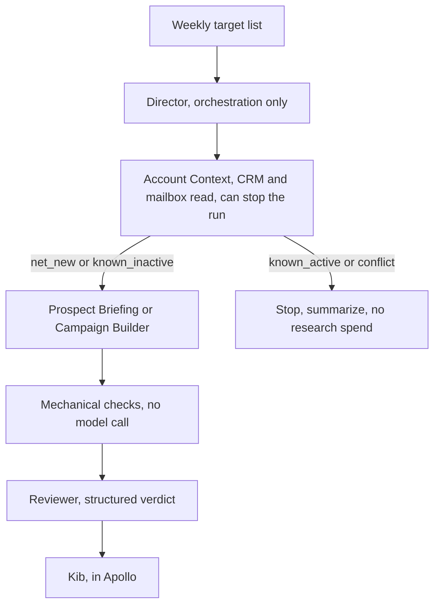

# Agent architecture rework, scope

Kib Cochran, 4 September 2026. Scope only. Nothing here is built yet.

## The decision, in one paragraph

Add **one** agent, Account Context, and give it the authority to stop a run.
Move the customer relationship management (CRM) reads off the Director so it
does orchestration and nothing else. Make the stop structural, not a prompt
rule, by putting the context verdict in the typed payload the Director must
send. Fold the ad hoc scripts in `smoke-test/` into tested commands in the
package. Do not add Fit Scoring, Briefing or Message agents: they share tools,
context and stop conditions with agents that already exist, so they are
checkpoints, not agents.

## Why, with the evidence from 4 September

Two classes of failure, and only one of them is about agents.

**Context misses, which the new agent prevents:**

| What happened | What a context check would have returned |
|---|---|
| Researched University of Central Arkansas twice before finding Ronnie Williams retired in 2021 | `known_inactive`, with the stale CRM contact named |
| Wrote that Wiley University was net new; it is HubSpot 8675080439, owner Miguel Pescador | `conflict` |
| Wayne Young Jr. was already in a live sequence with activity the previous day | `known_active` |
| Three of five contacts already existed; a bulk create overwrote their titles | `known_inactive`, before any write |

**Plumbing defects, which no agent topology fixes:**

wrong Apollo endpoint, so a sequence was created with zero steps; drafts signed
twice because Apollo appends a signature and the model typed one; a draft that
carried the reviewer check inside its body; a reveal cap of one that spent two
credits through a check-then-spend race; sequences owned by a colleague because
an application programming interface (API) key acts as the workspace's oldest
admin; five people in one sequence, which would have sent each of them all five
messages.

Six defects, zero fixed by adding an agent. The rework has to carry a plumbing
phase or it will not change the failure rate.

## Target architecture



| Agent | Job | Tools allowed | Tools blocked |
|---|---|---|---|
| Director | Pick the account, dispatch once | Handoffs, knowledge read | All CRM, all Apollo, all writes |
| Account Context | Establish what we already know, and stop the run when we do | HubSpot read, Apollo read, Notion ledger read, Outlook and Teams read when wired | Web research, any write, any draft |
| Prospect Briefing | Research one institution or person | Web, knowledge, Apollo read, ledger write | Apollo write, enrolment |
| Campaign Builder | Segment, copy, drafts, enrolment | Web, knowledge, Apollo read, Apollo draft write, enrolment, ledger write | Send, activate, approve |
| Reviewer | Grade, structured verdict | Knowledge, web | Everything else, including writing copy |

The Director losing HubSpot read is the point. Today it reads the CRM and then
decides; the reading and the deciding should not sit in the same agent, because
an agent that gathers its own evidence is the one that talks itself past a stop.

## The one new control

A prompt that says "stop if the account is owned" is a convention. The stop
belongs in the schema.

```python
class ContextVerdict(BaseModel):
    model_config = ConfigDict(extra="forbid")
    status: Literal["net_new", "known_inactive", "known_active", "conflict"]
    evidence: list[str]          # one line each, with a record id or a date
    owner: str                   # HubSpot owner, or "unassigned" / "not in HubSpot"
    open_deals: int
    live_sequences: list[str]    # Apollo sequence ids the person is already in
```

**Built differently from this sketch, and the sketch was wrong.** The plan was a
required `context: ContextVerdict` field on `WorkOrder`, reasoning that "the
Director cannot construct a passing verdict itself because it holds no CRM
tool". That is an argument about obtaining evidence. Typing JSON needs no tool:
a Director with nothing but a keyboard can write `status="net_new"` and a
plausible `searched` line, and a required field would have made writing one
mandatory rather than impossible.

So the verdict is carried on `DispatchContext`, stamped by the launcher from a
file the Account Context run wrote, before the run starts. No agent can write
it. `handoff_wiring._dispatch_recorder` refuses to dispatch when there is no
verdict at all, when the verdict names a different account than the work order
targets, and when the status is `known_active` or `conflict` without an
override. `work_order_only` puts the verdict in the worker's brief from the run
context rather than from the model's payload, and the launcher puts it in the
Director's input the same way.

That is the same shape as the controls that have held all along: the capability
is absent rather than discouraged. `WorkOrder` gained no field, so the scope's
stated risk that a required field breaks every dispatch path at once did not
apply.

**Kib's three decisions, 4 September:** the Director loses every CRM read;
`conflict` refuses but is overridable per run with a recorded reason; the same
override covers enrolment into a live sequence. The last one makes
double-sending reachable by one flag, which is why the enrolment refusal names
the sequences and spells out what proceeding means.

`live_sequences` exists because of Wayne Young Jr. Enrolment already writes into
a person's Apollo record; it should refuse when they are in another sequence
unless the verdict says otherwise.

## What changes, file by file

| File | Change | Rough size |
|---|---|---|
| `schemas.py` | `ContextVerdict`, `WorkOrder.context`, validators | small |
| `handoff_wiring.py` | Refuse dispatch on `known_active` and `conflict` | small |
| `agents_def.py`, `connectors.py` | New agent, tool scopes, Director loses CRM | medium |
| `prompts/context.md` | New prompt: evidence, no research, verdict only | new file |
| `prompts/director.md` | Cut the CRM reading, add the verdict requirement | small |
| `tools/hubspot.py` | Contact-level lookup, not only company | medium |
| `tools/apollo.py` | Sequence membership and account ownership reads | medium |
| `tools/apollo_enrol.py` | Refuse when `live_sequences` is non-empty | small |
| `scripts/` | Fold `write_v2.py`, `extend.py`, `write_probe.py` into tested commands | medium |
| `tests/` | Context verdict, dispatch refusal, enrolment refusal, script commands | 25 to 40 new tests |

## What does not change

Draft only, no send, no activate. Paused sequences with manual-email steps.
One recipient per sequence. Ledger records hashed and relayed. Reveal cap.
OAuth identity so writes are Kib's. Reviewer isolated, no memory, no copy.
252 tests that assert what the system cannot do.

## Explicitly out of scope

Fit Scoring, Briefing and Message agents. Five Notion databases; the ledger is
one append-only table and yesterday's failure was that nothing wrote to it, not
that it lacked schema. Automatic sending, sequence activation, mailbox drafts.
Outlook and Teams reads until credentials exist. Anything that would need the
`emailer_messages_send_now` or `emailer_campaigns_approve` scopes.

## Phases

| Phase | Goal | Done when |
|---|---|---|
| 0 | **Done, 4 September.** Plumbing. Scripts became `seats-drafts`; the parser, the write and the update live in the package | `smoke-test/superseded-scripts/` holds the old ones and nothing there runs; `tests/test_drafts.py` and `tests/test_live_run.py` cover the commands |
| 1 | **Done, 4 September.** Account Context, read only, advisory | The agent returns a verdict for a named account and the run continues regardless; verdict recorded in the ledger outbox as its own `kind` |
| 2 | **Done, 4 September.** The stop becomes structural | The run carries the verdict; dispatch refuses without one and on `known_active` or `conflict`; enrolment refuses on a live sequence; both overridable by Kib with a recorded reason |
| 3 | **Done, verified live 8 September.** Reviewer verdict as data | `ReviewVerdict` with an enumerated ground, a required quote and a required fix; `reviewer_gate` refuses before the model call on anything the counting settles |

**Out of band, 4 September: the copy standard was recalibrated.** Kib's call
after four rewrites of one batch. `prompts/_shared_copy_standard.md` holds six
closed rewrite grounds and an explicit floor, and the Campaign Builder and the
Reviewer both read it. This lands before Phase 3 rather than inside it, but it
constrains Phase 3: a structured verdict has an enumerated `ground` field now,
and `required fix` is meaningful only because a rewrite has to name one of six
things rather than any resemblance the grader noticed. Build the schema against
the six. See the README for the reasoning and the before/after.

**Phase 2 is done, 4 September.** Verified live rather than only in tests, on
the account that motivated it. A Director run against Wiley University with the
`conflict` verdict attached refused to dispatch, cited the verdict throughout
its plan, named what an override would authorise, and did not attempt the
handoff to see whether it would go through. The same run with
`--override "Miguel cleared this one for research only"` dispatched, recorded
the reason twice in the audit, and carried the conflict into the work order's
constraints as "Known account conflict; Kib override for research only".

Two defects surfaced only by running it:

1. The verdict was stamped where the handoff filter reads it, and the handoff
   filter builds the *worker's* input. The Director had a verdict on its run and
   correctly reported that it had none. The launcher now prepends it to the
   Director's input as a system fact.
2. The three Apollo read tools had been dead since the OAuth move, because they
   spoke only API key and the key was blank. Removing the key path fixed them;
   `apollo_find_org` and `apollo_find_roles` both ran in the override run.

**Phase 3 is done. Built 4 September, both halves verified live by 8 September.**

`ReviewVerdict` replaces prose. A finding carries `ground` from the closed list,
`quote` (the failing sentence, verbatim), `recipient`, `why`, and
`required_fix`. The schema refuses a rewrite with no finding and a ships with
findings attached, so the thing that produced four unshippable verdicts is now a
validation error rather than a matter of the model's judgement. `required_fix`
is what has to become true, not replacement copy; the Reviewer still writes none.

`reviewer_gate` runs the counting before the judging. The Reviewer is the most
expensive call in the chain, and a batch with two identical subject lines is
settled by a string comparison. Verified through the CLI: a batch with a
duplicated subject exits 4 with the finding printed and no model call made, and
the real 4 September artifact passes the gate cleanly, so it does not
false-positive on genuine copy.

**The typed verdict ran live on 8 September.** The 4 September attempt
returned 429 on the organisation's enforced spend limit before producing a
verdict, which implicated nothing in the code. The limit was raised on
8 September and the re-run produced a valid `ReviewVerdict` on the first
attempt: `rewrite`, one finding, ground `cadence_additivity`, the failing
sentence quoted, a required fix naming what has to become true, and
`standard_problem` null. Both halves of Phase 3 are now confirmed against a real
model. Log: `smoke-test/batch-1/reviewer-6.log`.

Phase 0 first is deliberate. Two of the six defects came from an untested script
I wrote by hand, and one of them reached a live sequence.

**Phase 1 is done, 4 September.** Account Context exists, holds no web search
and no write of any kind, is in nobody's handoff graph, and returns a typed
`ContextVerdict`. Run it with `scripts/live_run.py context -f in.txt`; the
launcher records the verdict to the outbox because the agent deliberately cannot.

Two live checks against the misses that motivated it, both in
`smoke-test/phase-1/`:

- **Wiley University** returned `conflict`. The 4 September run called it net
  new; the company is HubSpot 8675080439, owner Miguel Pescador. The record was
  found only because the agent tried `wileyc.edu` and "Wiley College" after
  `wiley.edu` matched nothing useful, which is the exact miss the `searched`
  field exists to expose.
- **Wayne Young Jr.** returned `conflict` with `live_sequences` naming
  6a8899a4482aef0010cb668a, and identified that it sends from
  adelarosa@seatsone.com. That mailbox is why it is a conflict rather than
  merely active: the HubSpot account is Kib's own.

Three defects in the new tools were found by running them rather than by
reading them, and all three are now tested:

1. `apollo_contact_status` spoke only API key, and `APOLLO_API_KEY` has been
   deliberately blank since the OAuth move. The tool was dead on arrival and
   reported "Apollo unavailable" in a way that reads like a finding.
2. The domain filter turned a hit into a silent miss. Filtered to the
   institution the caller believed Wayne worked at, Apollo returned nothing
   while holding him under another employer in an active sequence. The filter
   now falls back to a name-only search and logs both queries.
3. The no-match branch dropped the coverage caveat, which is the branch where
   it matters most: a narrow identity that finds nothing is the reading most
   easily mistaken for a clean account.

## Cost model

The unit is a usable account brief, not a contact. Today's run cost per account,
roughly: three to five model runs at checkpoint granularity, plus one Apollo
credit per revealed person, plus the reviewer. The context check is the cheapest
call in the chain and it fires first, so the saving is every research and copy
run that a `known_active` or `conflict` verdict prevents. On 4 September that
would have been two of six contacts stopped before any web research, and one
account, Wiley, stopped before a draft.

## Open decisions, yours not mine

**Settled 4 September:** 1, 2 and 5 below. The Director keeps no CRM read.
`conflict` refuses and is overridable in the run with a recorded reason. The
same override covers enrolment, so the stop is Kib's in both places and the
reason lands in the audit and the ledger. 3 and 4 are still open.

1. ~~Does the Director keep any CRM read at all, or is it purely dispatch?~~
   Purely dispatch.
2. ~~Is `conflict` a hard stop, or a stop that you can override in the run?~~
   Overridable, with a reason.
3. Should the Reviewer's verdict gate the Apollo write, now that the terminal
   halt is gone? Today nothing blocks a write except your judgement.
4. Outlook and Teams: worth wiring for context, or is HubSpot plus Apollo enough
   to answer "do we already know this school"?
5. ~~Who owns the stop when the account is a colleague's and you still want to
   write?~~ Kib, per run, with the reason recorded. Ownership on its own still
   does not block; a `conflict` verdict does, until overridden.

## Risks

The context agent is only as good as the CRM. Wiley was in HubSpot and my domain
query missed it, so a bad lookup produces a confident `net_new`. Phase 1 must
report what it searched, not only what it found.

Adding a required field to `WorkOrder` breaks every existing dispatch path at
once. Phase 1 keeps the verdict advisory precisely so that Phase 2 is a schema
change against a working agent rather than two changes at the same time.
