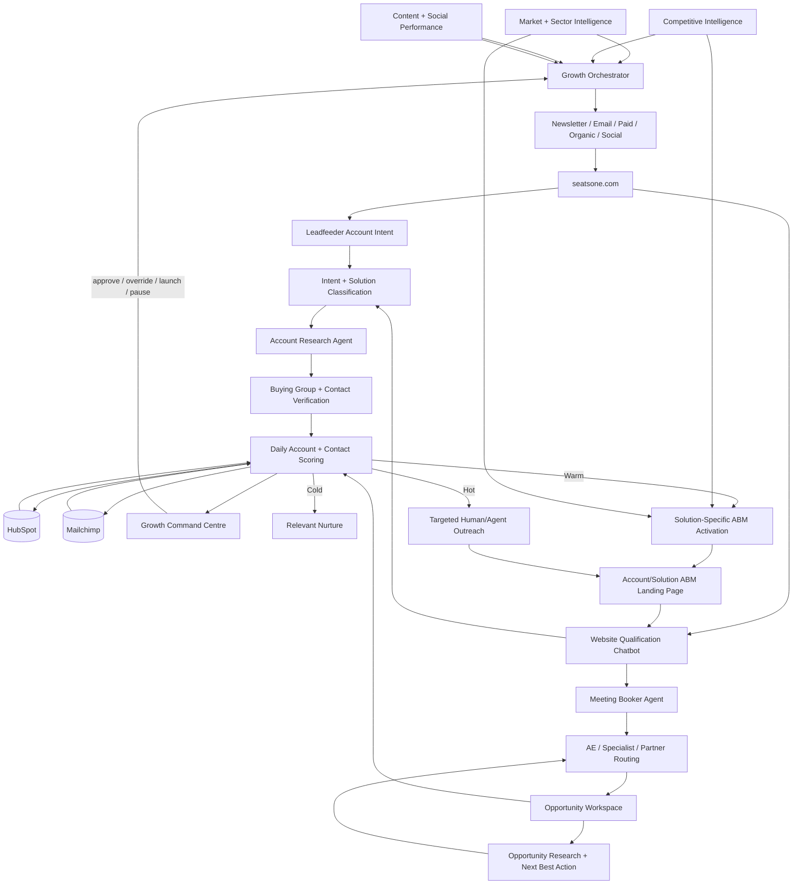
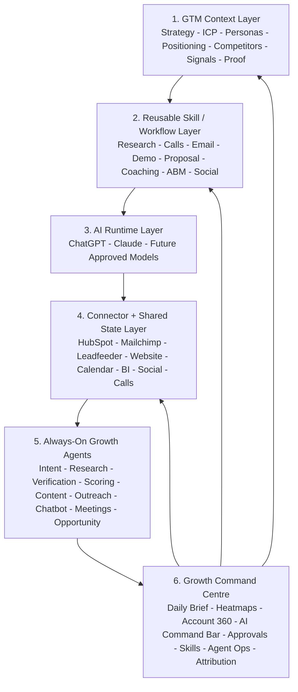

# SEAtS ONE Always-On Account-Based Marketing Engine

## Operating Instruction File

**Purpose:** Build and operate a scalable, cloud-based ABM system that runs continuously, converts marketing engagement into account intelligence, creates solution-specific experiences, and routes qualified buying signals into coordinated sales action.

**Primary website:** https://seatsone.com

**Operating principle:** Lead with the measurable institutional outcome and the problem the buyer needs to solve now; sell a clear product or paid diagnostic entry point; then expand across the SEAtS ONE Education Operations Platform as evidence, adoption and value grow.

**Core narrative:** Improve outcomes for thousands of students while protecting tens of millions in institutional revenue. SEAtS ONE connects Academic Operations, Student Operations, Compliance Operations and Campus Operations through a shared operational intelligence layer. Customer outcomes remain the primary proof; Microsoft, HPE Aruba Networking and analyst recognition are credibility enhancers, not the message itself.

---

## 1. Required Business Outcome

The system must continuously perform the following cycle:

1. Publish newsletters, campaigns, partner content, events, case studies and targeted outbound content.
2. Identify institution-level and known-contact engagement with SEAtS ONE content.
3. Interpret page visits, downloads, form submissions, event registrations and repeat visits as solution-interest signals.
4. Match each institution and contact to the relevant market, buyer role, product, use case and buying stage.
5. Create or update an account-specific ABM plan and personalised landing-page experience.
6. Verify the institution, contact, role, seniority, department and business email before outreach.
7. Find the wider buying committee and identify colleagues likely to share the same problem or influence the purchase.
8. Score the account and contacts using fit, intent, engagement, recency and buying-committee coverage.
9. Trigger compliant, relevant outreach from the correct SEAtS ONE representative.
10. Convert inbound enquiries and booked meetings into opportunity-specific workspaces, content, tasks and follow-up sequences.
11. Feed all activity, outcomes and attribution back into the CRM and reporting layer.

The engine must operate 24 hours a day, 7 days a week, 365 days a year using managed cloud services, monitored integrations, retry queues and audit logs.

---

## 2. Strategic Messaging Hierarchy

The ABM engine must use the same 1-to-4-to-product hierarchy across campaigns, landing pages, outbound, sales briefs and opportunity content.

### Level 1: Enterprise outcome

**Improve outcomes for thousands of students while protecting tens of millions in institutional revenue.**

Translate this into the institution's own measurable priorities: retention and progression, regulatory revenue protection, timetable quality, staff productivity, student service capacity, estate utilisation, sustainability, audit readiness and operational resilience.

### Level 2: Four connected operational pillars

1. **Academic Operations** — planning, scheduling, timetabling, exams, rooms and workload.
2. **Student Operations** — attendance, engagement, early alert, student support and casework.
3. **Compliance Operations** — UKVI, SEVIS, apprenticeships, professional/accreditation evidence and audit readiness.
4. **Campus Operations** — space utilisation, occupancy intelligence, smart campus and sustainability.

The shared layer is **operational intelligence and AI**: earlier visibility, better prioritisation, less administration and faster action.

### Level 3: Product entry points

Education buyers still buy products and pain-point solutions. Do not force a platform sale where a replacement or urgent operational problem is the buying trigger. Use Schedule, Attend, Engage, Care, Compliance and SmartSpace as clear entry points, then show the connected-platform expansion path.

### Proof hierarchy

Use proof in this order:

1. Customer outcomes and relevant references.
2. Measurable institutional value and business case.
3. Product/workflow evidence.
4. Microsoft foundation and integration.
5. HPE Aruba smart-campus alignment where relevant.
6. Analyst recognition as supporting credibility only.

Do not turn account pages into partner or analyst proof pages.

---

## 3. Solution and Market Taxonomy

Every web page, content item, campaign, contact, account, signal and opportunity must be tagged against a shared taxonomy.

### 4.1 SEAtS ONE solution groups

- Academic Scheduling and Timetabling
- Exam Scheduling
- Room Booking and Self-Service
- Workload and Space Planning
- Student Attendance and Engagement
- Retention, Early Alert and Student Success
- Student Case Management and Care, including mitigating circumstances and academic appeals
- UKVI and International Student Compliance
- Professional, Clinical and Vocational Accreditation
- Smart Campus, Space Utilisation and Sustainability
- IoT, BLE, Card Readers and Campus Safety
- Operational Intelligence and AI Agents, including advisor, scheduling, compliance, SmartSpace and executive workflows

### 4.2 Priority markets

- United Kingdom and Ireland
- United States
- Canada
- Australia and New Zealand
- Middle East
- Singapore and Malaysia
- DACH
- Scandinavia
- Spain, Portugal and Italy
- Latin America

### 3.3 Institution types

- Research university
- Teaching university
- Institute of technology
- Further education college or college group
- Community college
- State or university system
- Private not-for-profit institution
- Private for-profit institution
- Medical, nursing or clinical school
- Law or business school
- Professional membership or accreditation body
- Vocational, apprenticeship or technical training provider

### 3.4 Buyer and influencer roles

- President, Vice-Chancellor or Provost
- Registrar and Academic Registrar
- CIO, CTO, CDO and IT Director
- Head of Timetabling or Scheduling
- Student Success, Retention and Engagement leaders
- Student Affairs, Wellbeing and Casework leaders
- International Office and Visa Compliance leaders
- Deans of Medicine, Nursing, Law and Business
- Accreditation and Quality leaders
- Estates, Facilities, Space and Sustainability leaders
- Finance and Procurement
- Data, Analytics and Institutional Research
- Microsoft, cloud and enterprise architecture teams

---

## 4. Core Technology Architecture

Use a modular architecture so individual systems can be replaced without rebuilding the entire process.

### 4.1 Recommended logical layers

**Experience layer**
- seatsone.com web pages
- Account-specific ABM landing pages
- Forms, chat, meeting booking and event registration
- Personalised content recommendations

**Signal collection layer**
- Website analytics and first-party cookies
- Consent-management platform
- CRM tracking
- Newsletter and campaign engagement
- Webinar and event engagement
- Advertising and retargeting audiences
- Microsoft Marketplace and partner referral signals

**Identity and enrichment layer**
- Institution/domain matching
- CRM contact matching
- Business-email verification
- Role and employment verification
- Organisation and technology enrichment
- Buying-committee discovery

**Decision layer**
- Solution-interest classification
- Account and contact scoring
- Buying-stage classification
- Routing and suppression rules
- AI-generated research summaries and next-best-action recommendations

**Activation layer**
- CRM workflows
- Sales tasks
- Email sequences
- Advertising audiences
- Personalised landing pages
- Executive outreach
- Partner or Microsoft co-sell motions

**Data and control layer**
- Central customer/account data model
- Event stream or queue
- Audit logs
- Consent and suppression records
- Data-retention controls
- Reporting and attribution

### 4.2 Cloud operating requirements

- Run on Microsoft Azure unless a documented exception is approved.
- Use managed services, autoscaling and infrastructure as code.
- Use event queues so failures in one integration do not lose signals.
- Encrypt data in transit and at rest.
- Store secrets in Azure Key Vault.
- Use Entra ID, role-based access and least privilege.
- Maintain separate development, test and production environments.
- Add automated health checks, alerts, retry rules and dead-letter queues.
- Record the source, timestamp and processing history of every important signal.
- Do not allow AI-generated data to overwrite verified CRM data without validation.

---

## 5. End-to-End ABM Workflow

### Stage 1: Campaign publication

When a newsletter, webinar, report, case study, product update or partner campaign is published:

1. Apply solution, market, buyer, institution-type and funnel-stage tags.
2. Add campaign tracking parameters to every link.
3. Link each call to action to a relevant seatsone.com solution page or market-specific landing page.
4. Define the expected follow-up path before publishing.
5. Assign a campaign owner and sales owner.
6. Confirm consent, suppression and regional communication rules.

### Stage 2: Website signal capture

Capture at least the following events:

- Page viewed
- Repeat page viewed
- Time on page
- Scroll depth
- Video played or completed
- Resource downloaded
- Form started and submitted
- Chat started
- Meeting booked
- Event registration
- Pricing or procurement content viewed
- Security, integrations, Microsoft or implementation content viewed
- Customer story viewed
- Return visit within 7, 30 or 90 days

Each event must include:

- Timestamp
- Account or domain, where lawfully identifiable
- Known contact ID, where available
- Anonymous visitor ID
- Page and content tags
- Referring campaign and channel
- Geographic region
- Consent status
- Device and session information limited to what is necessary

### Stage 3: Solution-interest classification

Classify interest using page combinations rather than a single click.

Examples:

- Timetabling pages + room booking + implementation = Scheduling interest
- Attendance + UKVI + audit reporting = International compliance interest
- Early alert + case management + student app = Student success interest
- Space utilisation + IoT + energy = Smart campus interest
- Microsoft + Entra + Teams + Azure = Microsoft-platform interest

Maintain:

- Primary solution interest
- Secondary solution interest
- Interest strength
- First observed date
- Most recent date
- Number of engaged contacts
- Number of departments represented

### Stage 4: Account identification

1. Match known business email domains to institutions.
2. Match anonymous traffic only at institution or organisation level where permitted and technically reliable.
3. Do not identify or target individuals from anonymous traffic unless they subsequently identify themselves lawfully.
4. Merge duplicate institution records using an approved master account record.
5. Recognise university systems, campuses, colleges, schools and subsidiaries without incorrectly merging independent buying entities.
6. Attach the institution to the correct territory, salesperson, segment and market play.

### Stage 5: Contact verification

Before a contact is activated for sales outreach, verify:

- Full name
- Current institution
- Current job title
- Department or function
- Seniority
- Location or market
- Institution-owned business email
- Employment evidence and verification date
- Source of information
- Relevant solution or buying role

Acceptable verification sources include:

- Institution staff directory
- Institution leadership or departmental page
- Official conference or professional profile
- Current LinkedIn profile viewed or accessed in accordance with LinkedIn terms and approved tooling
- Direct response, form submission or email signature

Rules:

- Do not use personal email addresses.
- Do not guess an email and treat it as verified.
- Do not scrape LinkedIn or other sites using prohibited automation.
- Do not retain obsolete employment data after it is shown to be inaccurate.
- Reverify priority contacts every 90 days and all other active contacts every 180 days.
- Mark confidence as Verified, Probable, Unverified or Invalid.
- Only Verified contacts may enter automated outbound sequences.

### Stage 6: Buying-committee expansion

For every engaged account, identify relevant colleagues across:

- Economic buyer
- Operational owner
- Technical buyer
- Security and data protection
- Procurement and finance
- End-user leadership
- Executive sponsor
- Potential blocker
- Microsoft, infrastructure or integration owner

Buying-committee discovery must be based on the institution's structure and the detected solution interest.

Examples:

**Scheduling opportunity**
- Registrar
- Head of Timetabling
- Academic operations
- CIO or enterprise applications
- Estates and space planning
- Faculty operations

**UKVI opportunity**
- International director
- Visa compliance lead
- Registry
- Attendance owner
- CIO or integrations lead
- Data protection or compliance

**Student success opportunity**
- Provost
- Student success or retention lead
- Student affairs
- Institutional research
- Casework or wellbeing
- CIO or CRM owner

**Smart campus opportunity**
- Estates director
- Space-planning lead
- Sustainability director
- CIO or networking lead
- Security and safety
- Finance

Do not outreach to every discovered contact immediately. Prioritise likely members of the active buying group and coordinate messaging to avoid duplication.

---

## 6. Account and Contact Scoring

Use separate scores for account fit, account intent, contact engagement and buying-group completeness.

### 6.1 Account Fit Score: 0-100

- Target geography: 0-10
- Institution type: 0-10
- Student or learner scale: 0-15
- Strategic solution fit: 0-20
- Technology and Microsoft alignment: 0-10
- Regulatory or accreditation need: 0-10
- Known strategic initiative or procurement window: 0-15
- Existing relationship, partner route or customer expansion potential: 0-10

### 6.2 Account Intent Score: 0-100

- One solution page: +3
- Three related solution pages in 14 days: +10
- Two or more people from the institution engaged: +10
- Case study viewed: +5
- Integration, security or implementation page viewed: +8
- Pricing, procurement or marketplace page viewed: +12
- Resource downloaded: +10
- Webinar registration or attendance: +12
- Contact form submitted: +25
- Meeting booked: +40
- Repeat engagement within 7 days: +10
- No engagement for 30 days: reduce by 20%
- No engagement for 90 days: reset to nurture unless an active opportunity exists

### 6.3 Contact Engagement Score: 0-100

- Newsletter click: +3
- Relevant page visit: +4
- Repeat solution visit: +6
- Download: +8
- Webinar registration: +8
- Webinar attendance: +12
- Email reply: +20
- Form submission: +25
- Meeting booked: +40
- Unsubscribe: suppress immediately
- Hard bounce: invalidate immediately

### 6.4 Buying-Group Coverage Score: 0-100

- One verified relevant contact: 20
- Operational owner identified: +20
- Technical buyer identified: +15
- Economic buyer identified: +20
- Procurement/security path identified: +10
- Two or more departments actively engaged: +15

### 6.5 Activation thresholds

- **0-29:** Anonymous or low intent; continue general nurture.
- **30-49:** Early interest; personalise website and monitor.
- **50-69:** Marketing-qualified account; research and expand buying group.
- **70-84:** Sales-qualified account; create tasks and start coordinated outreach.
- **85-100:** High-priority account; executive outreach, tailored landing page and opportunity review.

A form submission, direct reply, referral or booked meeting can override the numeric threshold.

### 6.6 Daily Leadfeeder Hot / Warm / Cold scoring

Run a scoring job every day, using Leadfeeder website-account activity as a primary intent signal and combining it with HubSpot, Mailchimp, form, chatbot, meeting and CRM evidence. Do not treat Leadfeeder identification alone as proof that a named contact visited a page unless the identity is deterministically known.

Maintain two related scores:

- **ABM Account Score: 0-100** — institution-level fit, recency, frequency, depth, solution concentration, buying-group activity and commercial signals.
- **ABM Contact Score: 0-100** — verified contact fit, role relevance, known first-party engagement, email engagement, chatbot/form interactions, meeting activity and relationship status.

Also maintain a **Solution Interest Score: 0-100 for each solution**: Schedule, Attend, Engage, Care, Compliance, SmartSpace, Student App, Data/AI and Platform. The score must retain the evidence used to calculate it.

#### Daily temperature state

- **HOT:** score 70-100, or a high-intent override such as a meeting request, qualified chatbot hand-raise, demo request, direct reply, pricing/procurement activity or concentrated multi-person solution activity.
- **WARM:** score 40-69 with credible recent interest, repeated visits, solution concentration or multiple relevant stakeholders.
- **COLD:** score 0-39, weak/old activity, a single low-value visit, or target-account fit without current intent.

Use recency decay so the state changes automatically. Recommended default:

- Activity in last 7 days: 100% weighting.
- 8-30 days: 70% weighting.
- 31-60 days: 40% weighting.
- 61-90 days: 20% weighting.
- Over 90 days: no active-intent contribution unless an opportunity or active relationship exists.

A HOT score must not be produced merely because a large institution generated high anonymous traffic. Require either strong solution concentration, multi-session depth, multiple visitors/known contacts, a high-intent conversion, or corroborating CRM evidence.

### 6.7 Leadfeeder daily ingestion and evidence model

Every daily Leadfeeder ingestion must capture, where available:

- Institution/company name and domain.
- Visit date/time and recency.
- Number of sessions and page views.
- Entry and exit pages.
- Solution pages viewed.
- Case studies/resources viewed.
- Pricing, procurement, security, implementation or integration pages viewed.
- Geographic/office signals where appropriate.
- Existing HubSpot company/contact/opportunity status.
- Existing Mailchimp audience/member state.
- Known campaign/newsletter source where attributable.

Convert page URLs into the shared SEAtS ONE solution taxonomy. Example: repeated visits to timetabling, class scheduling, exam scheduling and room-planning pages should strengthen **Schedule** interest; UKVI, attendance evidence and compliance pages should strengthen **Compliance** and potentially **Attend** interest.

Store the highest three solution interests with scores plus an evidence summary such as:

`Schedule 82 — 3 sessions / 9 relevant page views / scheduling case study / room-planning page / 2 stakeholders engaged in 7 days.`

### 6.8 HubSpot and Mailchimp contact-level writeback

The daily scoring process must write the latest ABM state to every relevant verified contact associated with an engaged account, not only to the company record. Create or maintain the following fields in HubSpot and mirror the useful orchestration fields into Mailchimp merge fields/tags:

- ABM Account Score.
- ABM Contact Score.
- ABM Temperature: HOT / WARM / COLD.
- Primary Solution Interest.
- Primary Solution Interest Score.
- Secondary Solution Interest.
- Secondary Solution Interest Score.
- Solution Interest Evidence Summary.
- Last Intent Date.
- Intent Recency Days.
- Leadfeeder Account Active: Yes/No.
- Buying Role.
- Role Relevance Score.
- Buying-Group Coverage Score.
- Verified Employer.
- Verified Job Title.
- Verified Institution Email.
- Verification Date and Source.
- Current Outreach Play.
- Next Best Action.
- Last ABM Action Date.
- Active Opportunity: Yes/No.
- Suppression / Do Not Contact state.

Mailchimp should be used for permission-aware nurture and campaign orchestration; HubSpot remains the operational system of record for account/contact score, tasks, owner, opportunity state and sales activity. Never overwrite an unsubscribe, objection or suppression state from either system.

### 6.9 Contact expansion from account intent

When Leadfeeder identifies strong institution-level solution interest but the actual visitor is anonymous:

1. Match the institution to HubSpot.
2. Identify existing verified contacts in relevant functions.
3. Find additional likely buying-group colleagues using approved business-data sources and public institutional sources.
4. Verify current employer, title and institution-domain email before activation.
5. Rank contacts by role relevance to the detected solution.
6. Write the account intent signal to relevant contacts as **account-level evidence**, not as a false claim that the person personally browsed the website.
7. Trigger role-specific outreach only when policy, market and suppression rules permit.

This distinction must be preserved in the evidence model: `contact activity` and `account activity` are different signal types.

### 6.10 Trigger matrix by daily state

**COLD**
- Maintain light solution/market nurture.
- Enrich and verify strategically important contacts.
- No seller task from a single low-value Leadfeeder visit.

**WARM**
- Update HubSpot/Mailchimp solution tags.
- Move contact into a solution-specific nurture or targeted campaign.
- Generate/refresh the account research brief.
- Expand the buying group.
- Consider account-specific content or landing-page personalisation.
- Create a seller task when repeated activity or buying-group coverage justifies it.

**HOT**
- Alert the account owner immediately.
- Create a HubSpot task and next-best-action.
- Pause conflicting generic nurture.
- Activate the solution-specific ABM play for the relevant buying roles.
- Generate or refresh the account-specific landing page.
- Offer the most relevant next step: meeting, readiness assessment, diagnostic, pilot, replacement-planning workshop or tailored demo.
- Add executive/partner/Microsoft co-sell action where the account qualifies.

Temperature alone must not determine message copy. Message selection is driven by **solution interest evidence + buyer role + market + lifecycle/opportunity state**.

---

## 7. Account-Specific ABM Landing Pages

Create an account-specific experience when:

- Account Intent Score reaches 50;
- A target account has a live campaign;
- A meeting is booked;
- An opportunity is created; or
- Sales requests a page for an active strategic account.

### 7.1 Page requirements

Each page must contain:

1. Institution name and a relevant, non-creepy headline.
2. A measurable outcome-led hypothesis tied to the institution's problem or initiative.
3. The relevant product entry point: Schedule, Attend, Engage, Care, Compliance or SmartSpace.
4. The connected operational pillar and wider platform expansion path.
5. Market-specific regulatory, operational and institutional context.
6. Two or three outcomes and value metrics, not a long feature list.
7. Relevant customer proof and case studies as the primary credibility layer.
8. Microsoft foundation, integration, security and deployment information where it reduces buying risk; HPE Aruba proof where SmartSpace is relevant; analyst recognition only as subtle supporting proof.
9. A suggested paid readiness assessment, workshop, pilot, replacement programme or phased starting point where appropriate.
10. Named account owner or team contact.
11. A clear meeting, workshop, readiness assessment, pilot or replacement-planning call to action.

### 7.2 Personalisation rules

- Personalise to the institution and known business need, not to private individual behaviour.
- Do not state or imply that SEAtS ONE has secretly monitored a named person's browsing.
- Use verified public institutional priorities and first-party engagement data.
- Do not use confidential, sensitive or inferred personal data.
- All AI-generated claims must link to a source or be labelled as an internal hypothesis.
- Require human approval before publishing pages for strategic accounts or live opportunities.
- Use noindex controls where a page contains account-specific messaging not intended for public search.

---

## 8. Outreach Orchestration

### 8.1 General rules

Every outbound action must be:

- Relevant to the contact's role
- Relevant to the institution's detected or researched need
- Sent from the correct territorial or account owner
- Coordinated across the buying committee
- Logged in the CRM
- Compliant with consent, objection and suppression requirements
- Easy to opt out of

### 8.2 Recommended sequence by stage

**Early interest**
- Continue solution-specific newsletter or retargeting.
- Personalise the website experience.
- Do not trigger aggressive sales outreach from one low-value click.

**Marketing-qualified account**
- Verify relevant contacts.
- Create account research summary.
- Identify three to six likely buying-group members.
- Send one helpful, role-specific message from the account owner.
- Offer a relevant guide, benchmark, readiness assessment or customer story.

**Sales-qualified account**
- Create CRM task for the owner.
- Start a coordinated multi-contact sequence.
- Use separate messages for operational, executive and technical roles.
- Include the account landing page.
- Add LinkedIn manual engagement tasks where appropriate.
- Pause automation when a person replies.

**High-priority account**
- Add executive sponsor.
- Create an account plan and opportunity hypothesis.
- Coordinate email, phone, partner, Microsoft and event outreach.
- Build a tailored workshop or demonstration.
- Review activity weekly until advanced, disqualified or returned to nurture.

### 8.3 Commercial bridge offers

Long enterprise sales cycles must not leave the account with only a future platform proposal. Where appropriate, ABM should create a lower-risk paid next step that generates value now and advances the strategic sale.

Approved bridge offers include:

- Scheduling or timetabling readiness assessment.
- Student engagement / retention diagnostic.
- Compliance evidence and audit-readiness review.
- SmartSpace utilisation assessment.
- Data and AI readiness assessment.
- Fixed-scope pilot or proof of value.
- Executive workshop and transformation roadmap.

Every bridge offer must have a defined outcome, scope, price, duration, conversion path and owner. The CRM must track bridge-offer revenue separately while attributing any resulting platform opportunity.

### 8.4 Outreach suppression

Do not send automated outreach when:

- The contact has opted out or objected.
- The email is personal, unverified, bounced or role-generic unless specifically approved.
- There is an active complaint.
- Another SEAtS ONE employee is already in a live conversation.
- An active opportunity has a defined communication plan that would be disrupted.
- The account is a customer and Customer Success has not approved the message.
- Regional law or policy requires consent that has not been captured.

---

## 9. Inbound and Meeting-to-Opportunity Workflow

When a form, chat, reply, referral or meeting request is received:

1. Match or create the account and contact.
2. Validate the email domain and contact role.
3. Capture source, campaign, page history, solution interest and consent status.
4. Notify the account owner immediately.
5. Create an inbound response task with a service-level target.
6. Produce an AI-assisted briefing containing:
   - Institution overview
   - Relevant market context
   - Likely business problem
   - Pages and content engaged with
   - Existing CRM relationship
   - Suggested discovery questions
   - Likely buying committee
   - Recommended proof and demo path
7. Stop generic nurture sequences while the enquiry is actively handled.
8. When qualification criteria are met, create an opportunity.


## 9A. Website Qualification Chatbot Agent

Deploy an always-available SEAtS ONE website chatbot as part of the ABM signal and conversion layer. It must be grounded in approved seatsone.com content, solution messaging, customer proof, market-specific positioning and approved FAQs.

### Core requirements

The chatbot must:

1. Detect the current page, solution context, campaign/UTM and known account context where privacy rules allow.
2. Answer questions about Schedule, Attend, Engage, Care, Compliance, SmartSpace, Student App, Data/AI, integrations, implementation and relevant market use cases using approved content.
3. Ask lightweight qualification questions conversationally, including institution, role, problem, priority, current system, timing and desired outcome.
4. Avoid forcing a form before providing useful information.
5. Offer a relevant case study, guide, benchmark, readiness assessment, pilot or account-specific page based on the conversation.
6. Capture explicit solution-interest evidence from the conversation and feed it into the ABM Account Score and ABM Contact Score.
7. Distinguish customer-support enquiries from prospect conversations and route customers to the correct support/Customer Success path.
8. Escalate procurement, security, pricing, implementation or high-intent questions to a human owner where appropriate.
9. Respect consent, suppression and privacy rules and clearly identify itself as an AI assistant.
10. Store a concise conversation summary and qualification evidence in HubSpot when a known/consenting contact is created or identified.

### Chatbot intent outcomes

Classify conversations as:

- Research / education.
- Solution exploration.
- Active project.
- Replacement project.
- Compliance or regulatory urgency.
- Readiness assessment / pilot interest.
- Demo / meeting intent.
- Existing customer / support.
- Partner / Microsoft / HPE enquiry.
- Other / unclear.

A chatbot conversation can increase solution-interest and contact scores, but HOT status should require credible evidence such as explicit project timing, buying responsibility, replacement intent, a meeting hand-raise or other high-value signals.

## 9B. Meeting Booker Agent

The website chatbot and high-intent landing pages must have access to a meeting-booker agent that can convert qualified interest immediately.

### Core requirements

The meeting-booker agent must:

1. Determine the appropriate meeting type from solution interest and buyer need.
2. Route by territory, institution/account ownership, solution expertise and existing opportunity ownership.
3. Check real calendar availability through the approved calendar integration rather than displaying stale availability.
4. Offer appropriate meeting types such as discovery, tailored demo, scheduling replacement review, compliance readiness assessment, student-success diagnostic, SmartSpace assessment, AI/data readiness session or executive workshop.
5. Capture institution, business email, role, problem statement and priority solution before final booking where these are not already known.
6. Reject or separately handle personal-email bookings where the process requires verified institution-domain email.
7. Create/update the HubSpot contact and company, record source/campaign/chat context, update scores, and log the meeting.
8. Attach a pre-meeting brief containing solution evidence, Leadfeeder/account activity, chatbot summary, relevant stakeholders and suggested discovery questions.
9. Send confirmation and permitted reminders.
10. Trigger the opportunity-specific workflow after qualification, and pause conflicting automated nurture.

### Meeting routing hierarchy

Use this order unless an existing opportunity owner overrides it:

`Existing opportunity/account owner -> market/territory AE -> solution specialist/academic operations overlay -> appropriate fallback owner.`

For strategic accounts, the agent may recommend adding an executive sponsor, Microsoft co-sell contact or relevant solution overlay, but must not invite additional external parties automatically without the correct approval.

### Meeting conversion events

A completed booking must immediately:

- Set ABM Temperature to HOT for the known contact and engaged account.
- Add +40 meeting intent or apply the high-intent override.
- Persist the primary solution and evidence.
- Create the sales task/notification.
- Stop generic automated outreach to that contact.
- Generate/refresh the account-specific page and opportunity brief when applicable.
- Start the meeting-to-opportunity SLA.

### 9.1 Opportunity-specific workspace

For every qualified opportunity, create:

- Opportunity summary
- Problem statement
- Primary and secondary solution interests
- Stakeholders and buying roles
- Influence and relationship map
- Meeting notes and commitments
- Next action, owner and date
- Tailored landing page
- Relevant presentation, proof and case studies
- Technical, security and procurement requirements
- Competition and incumbent system
- Partner or Microsoft involvement
- Commercial value, probability and expected close date

Once an opportunity exists, opportunity rules take priority over generic ABM automation.

---

## 10. Customer Expansion and Adoption ABM

ABM does not stop at closed-won. Existing customers are a first-class growth segment. Use product adoption, Academy learning, support, executive review and value-realisation signals to identify responsible expansion opportunities.

Expansion signals include:

- Strong adoption of one module with an adjacent workflow gap.
- Low adoption that indicates an enablement need before commercial expansion.
- Customer administrator or practitioner certification activity.
- Executive dashboard and EBR engagement.
- Compliance, scheduling, student-success or SmartSpace use cases emerging in another department or campus.
- New regulatory, international/TNE, apprenticeship, placement or flexible-delivery requirements.
- Repeated requests for integrations, reporting, AI or cross-module workflows.

The system should distinguish **education/adoption need** from **commercial expansion readiness**. Where usage is weak, trigger Academy content, CSM action or train-the-trainer support before sales outreach. Where value is proven and an adjacent problem is verified, create an expansion hypothesis, map the additional buying group and route to Growth/Customer Success under the agreed account plan.

Customer education should be role- and workflow-based. Priority learning paths should align to Platform Foundations, Schedule, Attend, Engage, Care, Compliance, SmartSpace, Student App, Data/Reporting, AI, executive sponsors and customer administrators. AI workflow users must complete appropriate governance training before access.

---

## 11. AI Agent Instructions

The ABM AI agent may:

- Classify pages and content by solution and buyer relevance.
- Summarise institution-level engagement.
- Recommend contacts and buying roles for verification.
- Draft account hypotheses, landing-page content and outreach.
- For Care/casework opportunities, position near-term React parity and workflow continuity separately from future AI/new-capability differentiation; do not imply unshipped AI capability is already live.
- Recommend the next best action.
- Detect duplicate, stale or inconsistent CRM data.
- Suggest account clusters and campaign audiences.

The ABM AI agent must not:

- Invent people, roles, email addresses, institutional initiatives or engagement.
- Represent unverified information as fact.
- send external messages without the approved workflow and sender controls.
- Scrape websites or platforms in breach of their terms.
- Use personal emails or sensitive personal data.
- Make legal or similarly significant decisions about individuals.
- Continue contacting a person who has objected or opted out.

Every AI output must include:

- Source references
- Confidence level
- Verification status
- Recommended human reviewer
- Timestamp

---

## 12. CRM Data Model

### Account fields

- Master account name
- Domain and approved related domains
- Institution type
- Market and territory
- Student or learner scale
- Account owner
- Customer, prospect, partner or competitor status
- Primary solution interest
- Secondary solution interest
- Fit score
- Intent score
- Buying-group score
- Overall ABM stage
- First engagement date
- Latest engagement date
- Active campaign
- Landing-page URL
- Existing opportunity
- Data source and confidence

### Contact fields

- Full name
- Institution
- Job title
- Department
- Seniority
- Buying role
- Business email
- Email verification status and date
- Employment verification status and date
- Source URLs or evidence
- Consent and lawful-basis record
- Opt-out and objection status
- Primary solution interest
- Engagement score
- Last engagement
- CRM owner

### Signal fields

- Contact ID or anonymous ID
- Account ID
- Event type
- Source and campaign
- Page or asset
- Solution tag
- Buyer tag
- Timestamp
- Score value
- Consent status
- Processing result

---

## 13. Governance and Compliance

Before launch:

- Complete a data-flow map.
- Complete a legitimate-interests assessment where legitimate interests is relied upon.
- Determine regional consent and electronic-marketing requirements.
- Update the privacy notice to explain first-party analytics, profiling and direct marketing.
- Implement a consent-management platform.
- Complete a data-protection impact assessment for large-scale profiling or advanced personalisation.
- Define retention periods for anonymous visitors, contacts, signals and inactive accounts.
- Maintain a global suppression list.
- Ensure every outbound channel has an objection or unsubscribe path.
- Create a process for access, correction, deletion and objection requests.
- Review processors, international transfers and data-processing agreements.

The UK ICO states that B2B marketing can still involve personal data and PECR, and that publicly available information does not remove the need to comply with data-protection and direct-marketing rules. Legitimate interests is not automatic and requires a documented purpose, necessity and balancing test. Profiling must be transparent, fair and explainable. citeturn561793search0turn561793search1turn561793search2turn561793search6

---

## 14. Monitoring and Service Levels

### Operational service levels

- Inbound meeting or demo request: immediate alert
- High-intent form submission: immediate alert
- Contact verification for high-priority account: within one business day
- Marketing-qualified account review: within two business days
- Sales-qualified account acceptance or rejection: within two business days
- Broken integration or failed queue: alert within 15 minutes
- Unprocessed high-priority signal: alert within 30 minutes

### Daily monitoring

- Failed integrations
- Queue backlog
- Leadfeeder ingestion and daily score writeback
- HubSpot/Mailchimp field synchronization
- Chatbot qualification and escalation
- Meeting-booker calendar/routing health
- Form and meeting routing
- Email bounces and complaints
- Opt-outs and suppression
- Duplicate accounts and contacts
- High-intent accounts without owners
- Active opportunities still receiving generic nurture

### Weekly review

- New engaged accounts
- Accounts crossing activation thresholds
- Buying-group coverage
- Meetings and opportunities created
- Landing-page conversion
- Campaign-to-pipeline attribution
- False-positive signals
- Data-quality exceptions
- Sequence performance by market, solution and persona

---

## 15. Core Performance Measures

Measure:

- Target-account reach
- Engaged target accounts
- Engaged contacts per account
- Buying-group coverage
- Marketing-qualified accounts
- Sales-qualified accounts
- Meetings booked
- Opportunities created
- Pipeline value created
- Customer-expansion pipeline
- Paid assessment, workshop and pilot revenue
- Bridge-offer-to-platform conversion
- Product adoption and Academy-triggered expansion signals
- Time from first signal to first human action
- Landing-page conversion
- Account progression by solution and market
- Pipeline and revenue influenced
- Opt-out, complaint and bounce rates
- Contact-verification accuracy
- Percentage of opportunities with multiple active stakeholders

Do not optimise the system only for email opens or raw lead volume. Optimise for qualified account progression, buying-group engagement, opportunity creation and revenue.

---

## 16. Initial Implementation Sequence

### Phase 1: Foundation

- Finalise taxonomy.
- Clean account and contact data.
- Configure tracking, consent and campaign tagging.
- Define scoring and routing.
- Connect Leadfeeder, website, chatbot, meeting-booker, HubSpot, Mailchimp, newsletter and calendar systems.
- Build dashboards and audit logs.

### Phase 2: Signal-to-account automation

- Ingest Leadfeeder, website, chatbot, Mailchimp and campaign events daily or faster where supported.
- Resolve accounts and known contacts.
- Classify solution interest.
- Calculate account/contact/solution scores and HOT/WARM/COLD states, then write them to HubSpot and Mailchimp.
- Add alerts and sales tasks.

### Phase 3: Contact and buying-group intelligence

- Add approved employment and email-verification providers.
- Add human verification queues.
- Build role-based buying-group discovery.
- Add stale-data and duplicate detection.

### Phase 4: Personalised activation

- Build reusable landing-page templates by solution, market and buyer.
- Generate account-specific page drafts.
- Add review and publication workflow.
- Launch coordinated outreach plays driven by solution evidence, role, market and HOT/WARM/COLD state.
- Launch the qualification chatbot and meeting-booker conversion flows.

### Phase 5: Opportunity orchestration

- Create opportunity workspaces.
- Add AI briefing and discovery support.
- Add partner and Microsoft co-sell triggers.
- Measure pipeline and revenue attribution.

---

## 17. Definition of Done

The ABM engine is considered operational when:

- Every campaign and key seatsone.com page uses the shared taxonomy.
- Website and campaign engagement enters the event pipeline reliably.
- Accounts and verified contacts are matched without prohibited scraping.
- Solution interest and scores update automatically.
- Leadfeeder intent is recalculated daily into account/contact HOT, WARM or COLD states with recency decay and evidence.
- HubSpot and Mailchimp receive the required contact-level ABM, solution-interest and orchestration fields without overwriting suppression state.
- High-intent accounts create tasks and alerts for the correct owner.
- Buying committees are mapped and verified.
- Account-specific landing pages can be generated, reviewed and published using the outcome → pillar → product-entry-point → platform-expansion hierarchy.
- Inbound enquiries create complete sales briefings.
- The website chatbot qualifies visitors, captures explicit solution evidence and routes support versus prospect conversations correctly.
- The meeting-booker agent routes qualified visitors to live calendar availability, creates CRM records and triggers the meeting-to-opportunity workflow.
- Active opportunities suppress conflicting automation.
- Consent, objection, retention and audit controls are operating.
- Dashboards show account progression, meetings, opportunities, paid bridge revenue, expansion pipeline, platform pipeline and revenue.
- Existing-customer signals can trigger education, Customer Success action or expansion ABM without confusing low adoption with purchase intent.
- The process remains monitored and recoverable 24/7/365.

---

# 18. Growth Engine Workflow Diagram

The Growth Engine must operate as one shared, auditable system. Agents do not privately hand work to one another. They read and write shared account, contact, signal, campaign, content, opportunity, and agent-run state. Human users can inspect, approve, override, pause, or rerun any workflow from the Growth Command Centre.



## 18.1 Operating loop

1. Intelligence agents detect market, competitor, account, buyer and content signals.
2. The Growth Orchestrator converts qualified signals into account, campaign, content, social, ABM or sales actions.
3. Website and Leadfeeder activity produces institution-level solution intent.
4. Account Research enriches the institution and identifies relevant strategic initiatives, systems, likely problems and buying context.
5. Buying Group Discovery finds role-relevant colleagues and Contact Verification confirms current role, institution and institutional business email before activation.
6. The Scoring Agent recomputes account and contact Hot/Warm/Cold status every day and writes the evidence and score to HubSpot and Mailchimp.
7. Activation agents select the appropriate solution message, content, social surround, landing page and outreach play.
8. Chatbot and Meeting Booker convert active demand into a qualified human conversation.
9. Opportunity agents create a living account brief and next-best-action plan once a meeting or opportunity exists.
10. Performance data feeds back into strategy, content, scoring and repurposing.

# 19. Agent Workforce for the 24/7/365 Growth Engine

All agents must be stateless between runs except for shared database/CRM state. Every run must log: agent ID, trigger, inputs, sources, output summary, records changed, confidence, duration, status and human override where applicable. Agents must never fabricate contact identity, employment, institutional email, account activity or source evidence.

## 19.1 Growth Orchestrator Agent

**Purpose:** Coordinate priorities across intelligence, content, ABM, sales and opportunity workflows.

**Triggers:** Daily planning run; Hot account creation; material competitor/sector alert; qualified chatbot conversation; meeting booked; human on-demand request.

**Instructions:**
- Rank work by revenue potential, solution evidence, ICP fit, urgency and active opportunity context.
- Preserve product-entry motions: Schedule, Attend, Engage, Care, Compliance, SmartSpace, Student App, Data/AI and Platform.
- Align activity to the four operational pillars: Academic, Student, Compliance and Campus Operations.
- Do not create generic activity where account/solution evidence supports a more specific play.
- Assign work through shared state, not hidden agent-to-agent conversations.
- Escalate ambiguous high-value actions to a human rather than guessing.

## 19.2 Leadfeeder Intent Agent

**Purpose:** Convert daily institutional website activity into evidence-backed account intent.

**Instructions:**
- Ingest institution/company visits, page URLs, repeat visits, recency, depth and campaign/referrer context daily.
- Map every relevant page to one or more SEAtS solution and operational-pillar taxonomies.
- Aggregate anonymous activity to account level only.
- Never claim that a named person visited a page unless first-party identity evidence supports that attribution.
- Persist the underlying evidence used to calculate the score.

## 19.3 Account Research Agent

**Purpose:** Maintain a living institutional research brief for priority accounts.

**Research:** institution strategy, student numbers/profile, international/TNE/apprenticeship activity where relevant, transformation programmes, scheduling/timetabling environment, student-success priorities, compliance exposure, campus/estate initiatives, Microsoft/HPE/enterprise technology context, procurement activity, leadership changes, public tenders, relevant news and existing SEAtS relationship.

**Instructions:**
- Use current, attributable sources.
- Date every material finding and store source URL/reference.
- Separate fact from inference.
- Map evidence to SEAtS solution relevance and likely buyer roles.
- Refresh Hot accounts daily where material new evidence exists; Warm accounts at least weekly; Cold target accounts on a slower cadence.
- Produce a concise `why_now`, `solution_hypothesis`, `proof_to_use`, `risks`, and `recommended_next_action`.

## 19.4 Buying Group Discovery Agent

**Purpose:** Find the people likely to own the problem, influence the decision, control budget, operate the workflow or govern technology/procurement.

**Instructions:**
- Build buying groups around evidenced solution interest, not generic title harvesting.
- Find multiple relevant colleagues when account intent rises.
- Classify contacts as Economic Buyer, Problem Owner, Operational Owner, Technical Buyer, Procurement/Commercial, Executive Sponsor, Champion, Influencer or Partner/Microsoft stakeholder.
- Route every proposed contact through Contact Verification before outreach.

## 19.5 Contact Verification Agent

**Purpose:** Ensure contact data is suitable for ABM activation.

**Instructions:**
- Verify current institution and role from LinkedIn and/or the institution's official website or other reliable current source.
- Prefer current institutional staff directories and official leadership pages where available.
- Accept only institutional/business email addresses for outbound activation; no personal consumer email addresses.
- Store verification source, verification date and confidence.
- Mark uncertain or conflicting employment data for human review.
- Never infer an email address and mark it verified without independent evidence.

## 19.6 ABM Scoring Agent

**Purpose:** Recalculate account and contact scores daily and write Hot/Warm/Cold states to the Growth Engine, HubSpot and Mailchimp.

**Instructions:**
- Maintain separate Account Fit, Account Intent, Contact Fit, Known Contact Engagement, Solution Interest and Opportunity Momentum components.
- Maintain solution-specific scores rather than one opaque global number.
- Apply recency decay.
- Store an evidence summary explaining score movement.
- Never convert anonymous account browsing into fictitious named-contact engagement.
- Trigger state changes and next-best-actions only after successful CRM writeback.

## 19.7 Competitive Intelligence Agent

Extend the Content OS `competitor-monitoring` pattern into revenue operations. Monitor competitor product launches, pricing, messaging, campaigns, customer wins/losses, partnerships, tenders and material account-level competitor evidence. The existing blueprint requires sourced alerts, urgency classification and proof-backed counter-messaging; retain those controls.

**Instructions:**
- Scan the agreed competitor set daily and maintain current battlecards.
- Classify findings as Product, Pricing, Messaging, Campaign, Customer Win/Loss, Partnership, Procurement/Tender or Other.
- Assign Critical/High/Medium/Low urgency.
- Link competitive findings to affected SEAtS solutions, markets and named target accounts where evidence exists.
- For active opportunities, create an opportunity-specific competitive note rather than only a generic battlecard.
- Counter-message only with approved SEAtS claims/customer proof.
- Feed meaningful gaps to Product Messaging, Content Ideation, Account Research and the Growth Orchestrator.

## 19.8 Sector and Market Intelligence Agent

Use the Content OS `sector-research` operating pattern: monitor primary regulatory, policy and sector sources, cite the primary source, explicitly assess ICP relevance, and distinguish urgent alerts from routine intelligence.

**Instructions:**
- Run market-specific monitoring for UK/Ireland, US/Canada, Australia/NZ and other active markets.
- Tag each signal to relevant personas, solutions, accounts and campaigns.
- Convert high-relevance developments into account hypotheses and content opportunities.
- Do not alter regulatory meaning when summarising source material.

## 19.9 Product Messaging Agent

**Purpose:** Maintain the approved solution/message matrix used by every activation agent.

**Instructions:**
- Maintain message by market x persona x problem x solution x funnel stage.
- Keep customer outcomes as primary proof; Microsoft, HPE and analyst coverage act as confidence enhancers rather than the homepage/message hero. This follows the latest homepage strategy. fileciteturn2file0
- Prevent unsupported roadmap capabilities from being sold as current functionality.
- Supply approved value propositions, proof points, objections, CTAs and bridge offers to outreach, chatbot, landing-page and social agents.

## 19.10 ABM Landing Page Agent

**Purpose:** Generate and maintain solution-specific account experiences.

**Instructions:**
- Use `Outcome -> Operational Problem -> Solution Entry Point -> Evidence -> Platform Expansion -> CTA`.
- Personalise only from verified institutional/public evidence and CRM context.
- Do not expose private research, visitor surveillance language or invented claims on the page.
- Select CTA according to state: useful content/assessment for early interest, diagnostic/readiness workshop for Warm, meeting/pilot/opportunity CTA for Hot.

## 19.11 Outreach Agent

**Purpose:** Prepare targeted outreach using the account's actual solution evidence.

**Instructions:**
- Combine buyer role, account research, solution interest, relevant trigger and approved proof.
- Never say or imply "we saw you visiting X page" unless an identified first-party action makes that appropriate.
- Avoid generic multi-product pitches when one solution has clear evidence.
- Coordinate contact touches across the buying group to avoid duplicate or contradictory outreach.
- Require human approval for sensitive/high-value executive outreach until explicitly approved for automation.
- Stop generic nurture once a substantive human sales conversation/opportunity is active.

## 19.12 Website Qualification Chatbot Agent

Retain the existing chatbot requirements and additionally:
- Read the current page, campaign/UTM, known CRM context where permitted, account solution state and approved message library.
- Answer product/market questions using approved content.
- Qualify role, institution, problem, urgency, current approach/system and desired outcome conversationally.
- Route customer support, partner and prospect intents separately.
- Write a structured conversation summary and qualification evidence to HubSpot.
- Offer the Meeting Booker when qualification or explicit visitor intent supports it.

## 19.13 Meeting Booker Agent

Retain the existing meeting-booker requirements and additionally:
- Select meeting type and attendees from solution, market, account owner, buyer role and opportunity status.
- Check live availability before offering slots.
- Create/update HubSpot contact, company, activity and meeting records.
- Trigger a pre-meeting research brief.
- Never double-book, silently reassign an owned account, or create meetings without the visitor's explicit booking action.

## 19.14 Opportunity Research Agent

**Purpose:** Turn an inbound meeting or qualified opportunity into a continuously refreshed account plan.

**Instructions:**
- Merge CRM history, account research, buying group, solution intent, chatbot transcript, meeting notes, competitor evidence and relevant sector triggers.
- Produce: account thesis, business problem, likely impact, stakeholder map, competitor/status quo, discovery gaps, proof points, SPICED-style discovery prompts, recommended demo path and next-best-action.
- Refresh after every meaningful meeting, email response, opportunity stage change or new high-confidence signal.

## 19.15 Social Alignment Agent

Extend the Content OS `social-media` agent from content production into ABM surround.

**Instructions:**
- Maintain social themes aligned to active GTM campaigns, market signals and priority solution interests.
- Create platform-native posts rather than copying identical text across channels.
- When a cluster of target accounts shows the same solution interest, recommend relevant thought leadership, proof, short video, executive commentary or customer story to create ambient credibility around that issue.
- Do not publicly name target accounts as prospects or reveal private intent signals.
- Coordinate corporate, executive and sales-person social activity so messages reinforce rather than duplicate one another.
- Feed engagement from known first-party/social sources back to contact scoring only when identity and data rights permit.

## 19.16 Content Strategy and Ideation Agent

**Purpose:** Translate demand, sector, competitive and sales evidence into content priorities.

**Instructions:**
- Prioritise content gaps evidenced by target-account questions, search behaviour, competitor claims, sales objections and opportunity needs.
- Preserve the Content OS workflow for ideation -> SEO/LEO -> drafting -> editorial -> brand -> compliance -> publishing.
- Create solution-specific and market-specific content that can be reused in ABM pages, nurture, social and sales follow-up.

## 19.17 Content Production Agent Group

Reuse the existing Content OS agents for blog writing, LinkedIn thought leadership, social media, video scripts, design briefs, SEO/LEO, editorial review, brand governance, compliance review, publishing and repurposing. The Content OS architecture requires shared-state handoffs and mandatory quality gates before publishing; the Growth Engine must preserve that model rather than bypassing it for speed.

## 19.18 Performance and Attribution Agent

Extend the blueprint's `performance-analytics` agent beyond content metrics.

**Instructions:**
- Pull web, Leadfeeder, email, social, paid, chatbot, meeting, CRM and opportunity outcomes.
- Report by account, contact, solution, market, persona, campaign, channel and content asset.
- Track movement Cold -> Warm -> Hot -> Meeting -> Opportunity -> Pipeline -> Won/Lost.
- Attribute influence without pretending a single touch caused a complex enterprise sale.
- Feed high-performing content to repurposing and scoring-weight recommendations to human review.
- Detect false positives: high traffic without ICP fit, bot traffic, low-quality engagement or score inflation.

## 19.19 Data Quality and Governance Agent

**Purpose:** Keep the Growth Engine trustworthy.

**Instructions:**
- Detect duplicates, stale roles, personal emails, invalid domains, conflicting account ownership, missing consent/suppression state and stale verification.
- Enforce field definitions across HubSpot, Mailchimp and the Growth Engine.
- Quarantine records that fail activation rules rather than silently deleting them.
- Produce a daily exceptions queue.

# 20. Shared-State Agent Handoff Contract

Adopt the Content OS principle that coordination happens through shared data state, not opaque direct agent messaging. This makes the system auditable, replayable and replaceable.

Every agent handoff must write:

- `entity_type` and `entity_id` (account/contact/opportunity/content/campaign/alert).
- `workflow_stage`.
- `assigned_to` (agent ID or HUMAN).
- `status`.
- `handoff_notes` structured JSON.
- `last_reviewed_by`.
- `evidence_refs`.
- `confidence`.
- `next_best_action`.
- `created_at` / `updated_at`.

No handoff is complete until required fields validate successfully. Failed handoffs must appear in the Dashboard exception queue.

# 21. Growth Command Centre Dashboard

The uploaded Content OS defines its Dashboard as a fast read on system health, throughput and where a human should intervene. Preserve that concept, but expand it from content operations into the entire revenue engine.

## 21.1 Dashboard purpose

The Growth Command Centre is the human control plane for the 24/7/365 system. It must let a CMO, Growth Lead, Head of UK Growth, AE or authorised operator understand what changed, why it changed and what action the engine recommends, then approve/override/launch/pause work without operating each underlying tool separately.

## 21.2 Top KPI tiles

1. Hot Accounts Today / change vs yesterday.
2. Warm Accounts Today.
3. Hot Contacts / verified contacts.
4. Meetings Booked — 7/30 days.
5. Qualified Opportunities Created.
6. Pipeline Influenced / Created.
7. Active Agents / Total Agents.
8. Critical Competitive/Sector Alerts.
9. ABM Pages Live / Engaged.
10. Data Quality Exceptions.

Each tile must be clickable into a pre-filtered working view.

## 21.3 Primary views

### Daily Command Brief
AI-generated summary of: accounts heating up, accounts cooling down, new solution interest, meetings booked, major replies, competitor moves, market triggers, content performing, data issues and the ten highest-value recommended actions.

### Account Heatmap
Table/grid by account with Account Score, state, score change, top solution, evidence count, last activity, buying-group coverage, owner, next action and opportunity status.

### Contact Activation Queue
Verified contacts ranked by Contact Score and account context. Show role, buying-group role, institutional email status, known engagement, inherited account context, recommended message/play and approval state.

### Solution Intent Board
Columns for Schedule, Attend, Engage, Care, Compliance, SmartSpace, Student App, Data/AI and Platform. Show accounts entering/rising/falling in each solution category and the evidence causing movement.

### Account 360
One account workspace combining research brief, timeline, Leadfeeder intent, known contacts, buying group, scores, solution evidence, email/social engagement, chatbot conversations, meetings, content consumed, competitive context, opportunities and next-best-actions.

### Competitive Intelligence
Reuse and extend the Content OS Monitor view: urgency feed, competitor, affected solution/market/accounts, battlecard change, recommended response and status.

### Market/Sector Intelligence
Current regulatory, policy and sector signals with affected markets, personas, solutions, target accounts, campaign/content opportunities and action status.

### Content + Social Alignment
Show campaign themes, active content pipeline, target solution demand, social calendar, executive/corporate/sales alignment, top-performing assets and identified content gaps.

### Agent Operations
Status, last run, next run, queue depth, success/failure, average duration, records changed and human overrides for every agent. Clicking an agent exposes its recent audit log and current queue.

### Meetings + Opportunity Workspace
Upcoming meetings with qualification summary, account brief, stakeholder map, solution evidence, competitor context, discovery gaps and recommended next step. Active opportunities show signal changes after opportunity creation without letting marketing automation interfere with the sales motion.

### Performance + Attribution
Funnel by Cold -> Warm -> Hot -> Meeting -> Opportunity -> Won/Lost; pipeline by solution/market/source; time in state; conversion rates; campaign/content influence; chatbot conversion; meeting-booker conversion; account coverage and buying-group penetration.

### Exceptions + Approvals
Single queue for executive outreach approval, questionable contact verification, personal email rejection, duplicate/conflicting records, failed sync, score anomalies, unsupported claims, publishing approvals and agent failures.

## 21.4 Dashboard interaction requirements

Unlike the original Content OS Dashboard, which is primarily read-only, the Growth Command Centre must support controlled actions:

- Approve / reject recommended outreach.
- Pause / resume an account or contact.
- Override Hot/Warm/Cold with reason and expiry date.
- Change account owner subject to permissions.
- Launch an approved ABM play.
- Request fresh account research.
- Request buying-group expansion.
- Generate/refresh an ABM landing page.
- Open the account in HubSpot.
- Add/remove from approved Mailchimp nurture.
- Request content/social response to an intelligence signal.
- Accept/dismiss a competitor alert.
- Rerun a failed agent.

Every human action must be logged and must update shared state so downstream agents see the decision.

## 21.5 Refresh and alerting

- Agent health and critical alerts: 30-60 seconds where technically appropriate.
- Website/Leadfeeder signal ingestion: near-real-time where available plus guaranteed daily reconciliation.
- Account/contact scores: daily full recompute plus event-driven recompute for high-value events such as form submission, qualified chatbot, meeting booked, substantive reply or opportunity creation.
- Aggregate dashboard metrics: five-minute cache/refresh is acceptable.
- CRM and Mailchimp writeback failures: alert immediately into Exceptions.

# 22. Growth Engine Control Rules

1. **Evidence before automation.** Every activation must be explainable from stored evidence.
2. **Account intent is not person intent.** Anonymous institutional traffic stays account-level.
3. **Verified contacts only.** Current role/institution and business email are prerequisites for automated outbound activation.
4. **One solution hypothesis at a time where possible.** Lead with the evidenced pain, then expand to platform value.
5. **Human control remains visible.** High-impact decisions can be approved, overridden, paused and audited from the Command Centre.
6. **Opportunity protection.** Once a substantive sales motion exists, the AE/opportunity plan governs communications and generic automation is suppressed.
7. **Shared state is the system of record for orchestration.** Agents coordinate through records and status transitions, not hidden conversations.
8. **Content and sales use the same intelligence.** Sector, competitor, account and performance evidence must flow into both content priorities and account activation.
9. **Customer outcomes remain the proof hierarchy.** Partner/analyst credibility supports the story rather than replacing it. fileciteturn2file0
10. **Training/adoption can create expansion signals.** Where the engine is later extended into customer growth, distinguish a training need from genuine expansion intent, consistent with the Academy strategy. fileciteturn2file1

# 23. Updated Definition of Done

The Growth Engine is operational when:

- Daily Leadfeeder account intent is ingested and mapped to solution evidence.
- Account and contact Hot/Warm/Cold scores are recomputed and written to HubSpot/Mailchimp.
- Contact verification prevents unverified/personal emails from automated activation.
- Account Research and Buying Group agents maintain current priority-account intelligence.
- Competitive and sector intelligence feed both content and ABM actions.
- Content/social activity aligns dynamically to solution demand without exposing private account intent.
- Website chatbot qualifies demand and Meeting Booker routes qualified meetings correctly.
- Every meeting produces an account/opportunity brief.
- Account-specific ABM pages can be generated/refreshed from approved evidence and messaging.
- The Content OS agents remain available for content creation, review, publishing and repurposing.
- The Growth Command Centre exposes the entire system, its evidence, queues, recommendations, exceptions and agent health.
- Humans can approve, override, pause, launch and rerun actions from the dashboard.
- Every agent action and human override is auditable.
- The system can run continuously in cloud infrastructure without requiring a human to manually move data between Leadfeeder, HubSpot, Mailchimp, the website, content workflows and sales workflows.

# 24. Vendor-Neutral AI GTM Context and Skills Architecture

The SEAtS ONE Growth Engine must support multiple AI runtimes, including ChatGPT and Claude, without duplicating business logic or allowing each model to develop a different view of the market.

The operating principle is:

> **Business context and GTM workflow definitions are the durable system of record. ChatGPT, Claude, or future models are execution environments.**

Do not hard-code core strategy, ICP logic, positioning, competitor rules, scoring logic, messaging or sales methodology only inside one assistant's proprietary configuration.

Maintain a centrally version-controlled **GTM Context Layer** and **Workflow/Skill Library**. Runtime-specific implementations may wrap these files, but must reference the same approved source content.

## 24.1 Recommended repository structure

```text
/growth-os
  /context
    company-profile.md
    icp-and-segmentation.md
    buyer-personas.md
    positioning-and-messaging.md
    solution-message-matrix.md
    reference-customers.md
    competitor-intelligence.md
    signal-library.md
    market-playbooks.md
    sales-methodology.md
    proof-and-claims-register.md
    compliance-and-outreach-rules.md
  /skills
    account-research.md
    buying-group-research.md
    contact-verification.md
    cold-email-writer.md
    cold-call-prep.md
    discovery-prep.md
    demo-prep.md
    meeting-brief.md
    client-reference-finder.md
    business-case-builder.md
    proposal-builder.md
    post-call-coaching.md
    competitive-battlecard.md
    social-surround.md
    content-brief.md
    abm-landing-page.md
    opportunity-plan.md
    executive-brief.md
  /schemas
    account.json
    contact.json
    signal.json
    score.json
    opportunity.json
    content.json
    agent-run.json
  /runtime-adapters
    /chatgpt
    /claude
    /other
  /dashboard
    command-centre-spec.md
  /tests
    golden-examples.md
    regression-cases.md
```

Use Git or another controlled repository as the canonical source, with pull requests, version history, named owners and release notes for material GTM changes.

# 25. GTM Context Layer

The context layer tells any approved AI runtime **how SEAtS ONE sells**. It must be concise enough for retrieval, structured enough for selective loading, and explicit enough that agents do not invent strategy.

## 25.1 Company profile

`company-profile.md` must contain:

- SEAtS ONE company and platform description.
- Product family: Schedule, Attend, Engage, Care, Compliance, SmartSpace, Student App, Data/AI and connected platform capabilities.
- Core use cases by product and operational pillar.
- Deal profile by market and segment.
- Typical entry product/pain point and likely platform expansion path.
- Buyer and budget-owner patterns.
- Typical procurement characteristics and long-cycle enterprise constraints.
- Reference customers and approved proof points.
- Microsoft/HPE/other ecosystem proof as supporting credibility, not the primary customer story.

The strategic narrative must remain outcome-led: improve student/institutional outcomes and protect institutional revenue, with product entry points remaining clear. fileciteturn2file0

## 25.2 ICP and segmentation

`icp-and-segmentation.md` and `buyer-personas.md` must define:

- Tier 1 / Tier 2 / Tier 3 account criteria.
- Institution type and size.
- Geography and market-specific requirements.
- Current technology/environment indicators.
- Problem intensity.
- Relevant regulatory or operational pressure.
- Buying committee roles.
- Problem owner.
- Budget owner.
- Technical approver.
- Executive sponsor.
- Procurement/security stakeholders.
- Desired outcomes.
- Common objections and internal blockers.
- Trigger events that increase urgency.

Persona records must describe the buyer's **jobs, problems, desired outcomes, evidence needs, objections and likely CTA**, not merely job-title demographics.

## 25.3 Positioning and messaging

`positioning-and-messaging.md` and `solution-message-matrix.md` must define:

- Core value pillars.
- Product-specific value propositions.
- Market-specific message variants.
- Persona-specific message variants.
- Approved unique selling points.
- Proof hierarchy.
- Vision narrative.
- Objection frameworks.
- Competitive framing.
- Outcome statements.
- Discovery hooks.
- Approved CTAs.
- Readiness assessment / diagnostic / pilot bridge offers.
- Claims that require human/compliance review.

Every outbound, chatbot, landing-page, social and opportunity skill must retrieve from these files rather than creating new positioning independently.

## 25.4 Competitor intelligence

`competitor-intelligence.md` is the durable competitive context and must be refreshed by the Competitive Intelligence Agent.

For each relevant competitor record:

- Positioning and category narrative.
- Product/module overlap.
- Market strength.
- Known target segments.
- Typical incumbent footprint.
- Win/loss patterns.
- Reasons SEAtS wins.
- Reasons SEAtS loses.
- Common objections created by that competitor.
- Known integrations/partnerships.
- Migration concerns.
- Approved counter-positioning.
- Evidence/source links and last-verified date.
- Confidence.

Agents must distinguish verified external facts, internal win/loss observations and hypotheses.

## 25.5 Signal library

`signal-library.md` is the canonical definition of intent and trigger evidence.

Each signal must define:

- Signal ID and name.
- Source.
- Account-level or contact-level status.
- Solution mapping.
- Weight.
- Recency/decay rule.
- Confidence.
- Positive/negative effect.
- Recommended hook angle.
- Eligible personas.
- Next-best-action.
- Automation eligibility.
- Human approval requirement.

Examples include:

- Repeated Schedule/timetabling page visits.
- Compliance content consumption.
- Named contact email click on a solution-specific CTA.
- Qualified chatbot discussion.
- Pricing/demo page visit from a known contact.
- Meeting booking.
- New regulation/policy affecting an account.
- Leadership change.
- Competitor procurement/contract signal.
- Tender or transformation programme.
- Existing customer adoption/expansion signal.

The account-versus-person distinction remains mandatory: institutional web intent must not be represented as named-person browsing unless first-party identity evidence supports that attribution.

# 26. Reusable Workflow / Skill Layer

A **skill** in the Growth OS is a vendor-neutral reusable workflow specification. ChatGPT Skills, Claude project/workflow instructions or future runtime equivalents may implement it, but the canonical version lives in `/skills`.

Each skill file must specify:

```text
Name
Purpose
When to use
Required inputs
Context files to retrieve
Live systems/data required
Steps
Decision rules
Output schema
Writeback actions
Approval gates
Prohibited actions
Evidence/citation requirements
Audit fields
Example input/output
```

## 26.1 Core revenue skills

The library must include at minimum:

### Account Research
Create a sourced account dossier including institution strategy, relevant initiatives, current systems where verifiable, leadership, problem hypotheses, recent signals, relevant SEAtS solutions, competitor context and recommended opening angle.

### Buying Group Research
Identify the likely problem owner, budget owner, champion, technical stakeholder, procurement/security stakeholders and executive sponsor. Verify current employment/role before activation.

### Contact Verification
Verify current institution, role/title and institution business email. Reject personal email addresses for automated business outreach.

### Cold Email Writer
Use only approved context, current account evidence and the highest-confidence solution hypothesis. Avoid false personalization and unsupported claims.

### Cold Call Prep
Produce a concise account hypothesis, buyer problem, evidence, opening, discovery questions, objection responses and next-best CTA.

### Discovery Call Prep
Build a SPICED-compatible or approved SEAtS discovery plan using existing account/opportunity evidence and identifying the missing information that matters most.

### Demo Prep
Create a role/solution-specific demo narrative based on discovery evidence. Do not default to broad platform tours when the buyer entered through a specific problem.

### Meeting Brief
Combine account research, buying-group map, Leadfeeder/account intent, named-contact engagement, chatbot history, competitive evidence and open CRM activity into a one-page seller brief.

### Client Reference Finder
Find the best approved customer reference by problem, segment, geography, solution, scale and buyer concern. Never invent a reference or customer outcome.

### Business Case Builder
Translate discovered problems into measurable operational/financial outcomes, assumptions, evidence gaps, implementation path and decision criteria.

### Proposal Builder
Generate proposal content from approved scope, discovery, pricing inputs, proof and value case. Commercial/legal commitments require human approval.

### Post-Call Coaching
Review transcript/notes against the approved discovery and opportunity methodology; identify evidence captured, gaps, risks, coaching points and CRM updates.

### Competitive Battlecard
Generate opportunity-specific competitor guidance from current sourced intelligence plus internal win/loss patterns.

### Social Surround
Translate observed solution demand and market themes into coordinated corporate, executive and seller social activity without exposing private account-level intent.

### Opportunity Plan
Maintain a living opportunity view: outcomes, stakeholders, compelling event, competition, risks, missing evidence, next actions, relevant content and executive/partner support.

## 26.2 Context inheritance rule

Skills must **reference context, not copy it**.

If `positioning-and-messaging.md` changes, every skill that uses positioning must see the new approved version on its next run. If competitor intelligence changes, battlecards and opportunity plans must update without editing each skill separately.

Runtime adapters may cache context for performance, but must record `context_version` and invalidate stale versions.

# 27. Runtime and Connector Layer: ChatGPT, Claude and Future Models

The Growth Engine must expose the same business context, structured records and approved actions to different model runtimes through a controlled connector layer.

## 27.1 Runtime abstraction

Treat ChatGPT and Claude as interchangeable **execution clients** where practical.

Each runtime adapter must provide:

- Retrieval of approved context files.
- Invocation of canonical workflow/skill definitions.
- Access to approved connectors/actions.
- Structured output validation.
- Citation/source preservation.
- Approval handling.
- Writeback to shared state/CRM.
- Audit logging.

No runtime may become its own independent system of record for account status, scoring, messaging or opportunity data.

## 27.2 Connector/MCP pattern

Use MCP or equivalent secure connectors where supported. Where no native connector exists, use a governed integration/API layer such as Azure Functions/Logic Apps, n8n, Make or Zapier where appropriate.

Required integration domains include:

- HubSpot: contacts, companies, opportunities, activities, lifecycle, ownership, ABM scores and solution-interest fields.
- Mailchimp: approved nurture membership, engagement events, suppression and campaign activity.
- Leadfeeder: account-level website intent and visit evidence.
- Website/CMS: pages, forms, chatbot context and ABM landing-page publishing workflow.
- Email and calendar: approved seller actions, replies, meeting availability and bookings.
- BI/warehouse: pipeline, attribution and performance data.
- Call recording/transcription system where available: meeting evidence and coaching workflows.
- Social/publishing systems where available: approved content publishing and performance retrieval.
- Competitive/market sources: public web and approved data services.

All write-capable connectors require explicit permission scopes. High-impact actions must preserve the approval gates defined elsewhere in this instruction.

## 27.3 Shared state contract

Every runtime reads/writes the same canonical entities:

- Account.
- Contact.
- Signal.
- Solution interest.
- Score and score explanation.
- Buying group.
- Campaign/play.
- Content asset.
- Meeting.
- Opportunity.
- Competitor evidence.
- Market signal.
- Agent/workflow run.
- Human approval/override.

Every workflow run must store:

- `runtime` (for example ChatGPT or Claude).
- `model` where available.
- `skill_id`.
- `skill_version`.
- `context_version`.
- `trigger`.
- `inputs`.
- `sources`.
- `output_summary`.
- `records_changed`.
- `approval_status`.
- `human_override`.
- `confidence`.
- `started_at` / `completed_at`.
- `status` / error details.

This allows side-by-side evaluation of runtimes without changing GTM process.

# 28. Team Distribution and Governance

The Growth OS must be shareable across sales, marketing, growth, customer success and leadership while remaining centrally governed.

## 28.1 Central distribution

Store the canonical context and skills library centrally, preferably in a private Git repository or another version-controlled team repository.

Runtime-specific distribution may include:

- ChatGPT Skills / workspace instructions where appropriate.
- Claude shared projects/workflows or equivalent team environment where appropriate.
- CI/CD packaging of runtime adapters.
- Read-only retrieval of approved context for users who should not edit strategy.

Do not manually maintain separate master copies in ChatGPT and Claude.

## 28.2 Ownership

Assign named owners to:

- Company/strategy context.
- ICP/personas.
- Positioning/messaging.
- Competitor intelligence.
- Signal/scoring library.
- Sales methodology.
- Compliance/outreach policy.
- Individual reusable skills.
- Connector permissions.
- Dashboard configuration.

Changes to core positioning, scoring or automated outreach rules require review before release.

## 28.3 Versioning and tests

Every material change must create a new version and run regression tests against representative scenarios, including:

- Tier-1 hot Schedule account.
- Anonymous institutional visitor with no known contact identity.
- Known contact with high engagement but weak ICP fit.
- Strong account intent with no verified contacts.
- Competitor displacement opportunity.
- Existing customer showing potential expansion intent.
- False-positive/noisy web signal.
- Personal email discovered for otherwise relevant contact.
- Opportunity already under active AE control.

Golden outputs should test message alignment, evidence discipline, score interpretation, safety/compliance rules and correct CRM writeback instructions.

# 29. Growth Command Centre: AI Interaction Layer

Extend the Growth Command Centre so human users can interact with the engine through either ChatGPT-like or Claude-like conversational interfaces while still operating against the same governed backend.

## 29.1 AI Command Bar

Add a persistent command/search interface able to answer or initiate approved workflows such as:

- "Show me today's hottest UK Schedule accounts."
- "Why did University X move from Warm to Hot?"
- "Research the buying committee for this account."
- "Find the best customer reference for this opportunity."
- "Prepare me for tomorrow's discovery call."
- "Show competitor evidence for this account."
- "Draft outreach to the verified registrar based only on current evidence."
- "Create a social surround for the current UK scheduling theme."
- "Build a business-case outline from this opportunity."
- "What changed in our pipeline overnight?"

The UI may allow the user to choose an execution runtime (for example ChatGPT or Claude) where useful, but the underlying data, context, workflow definition, approvals and audit record remain identical.

## 29.2 Context Inspector

For every AI-generated recommendation, expose:

- Context files used.
- Version numbers.
- Live CRM/intent sources used.
- External sources used.
- Skill/workflow invoked.
- Confidence.
- Records that would be changed.
- Required human approval.

This makes the AI system explainable to sellers, marketers and administrators.

## 29.3 Skill/Workflow Registry

Add a dashboard view listing:

- Skill name.
- Purpose.
- Owner.
- Current version.
- Context dependencies.
- Connected systems required.
- Last run.
- Success/failure rate.
- Average user rating where captured.
- Pending changes.
- Test status.

Authorized administrators can publish, deprecate or roll back workflow versions. Business users can invoke approved skills but cannot silently change canonical strategy.

## 29.4 Runtime Evaluation

The dashboard should allow controlled comparison of ChatGPT, Claude or future approved runtimes using the same input and canonical skill/context version.

Measure:

- Output usefulness.
- Evidence accuracy.
- Hallucination/unsupported-claim rate.
- Structured-output compliance.
- Latency.
- Cost.
- Human edit rate.
- Conversion/business outcome where attributable.

Runtime choice should therefore be an operational optimization, not a rewrite of the GTM system.

# 30. Updated Architectural Principle

The complete SEAtS ONE Growth Engine should now be understood as six layers:



The loop is deliberate: performance, seller feedback, customer evidence and win/loss data improve the context and workflows; they do not remain trapped inside individual AI conversations.

## 30.1 Final rule

> **One business context. One shared revenue state. One governed workflow library. Multiple AI runtimes. Many specialized agents. Human control through one Growth Command Centre.**

This is the architecture required to make SEAtS ONE's Growth Engine durable, shareable and scalable across ChatGPT, Claude and future AI platforms.
